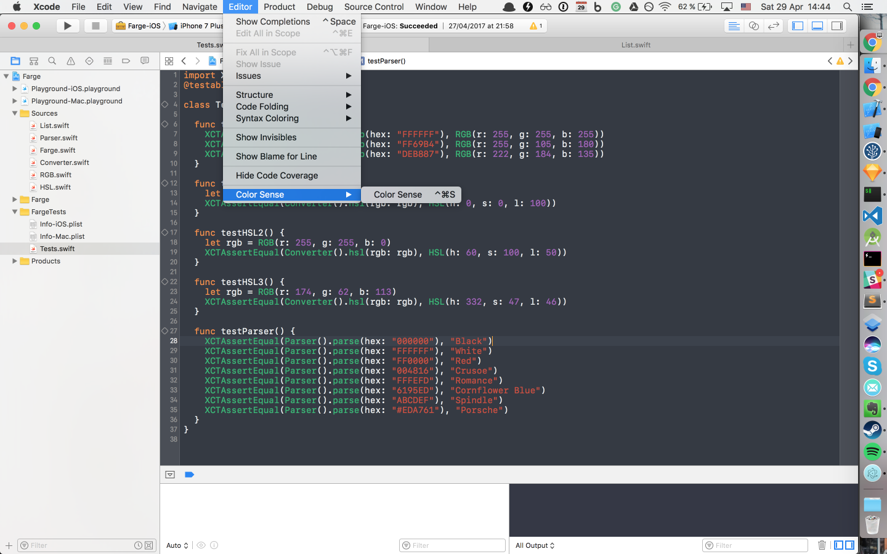
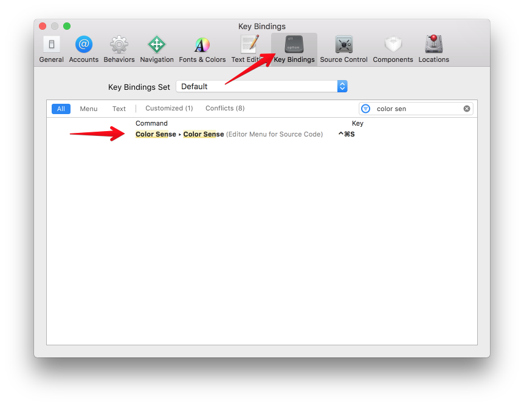

# XcodeColorSense2

## Story

All my apps use hex color now. But when browsing the source code, it's hard to know which color it is, I normally need an app or go to Chrome to checkout the color, I want to do that within Xcode

That's why I made [XcodeColorSense](https://github.com/onmyway133/XcodeColorSense), which shows us the color for a particular hex or rgb color. But from Xcode 8+ it is not possible to have Xcode plugin.

So this is my 2nd attempt to make that available in Xcode, through Xcode Source Editor Extension. I used [Farge](github.com/onmyway133/Farge) to find name of a hex color

I want to use framework in the extension, but Xcode keeps complaining about that http://stackoverflow.com/questions/43673353/how-to-use-framework-in-xcode-source-editor-extension

I use [GifCapture](https://github.com/onmyway133/GifCapture) to capture the gif

## How to install

- Follow my tutorial here [Install Xcode 8 Source Editor Extension](https://medium.com/@onmyway133/install-xcode-8-source-editor-extension-10c9849e33b0)

## How to use

- `Color Sense` is available in `Editor -> Color Sense -> Color Sense`. Click it to show color name, click it again to hide color name

- Use key binding to make it more convenient

## Author

Khoa Pham, onmyway133@gmail.com
